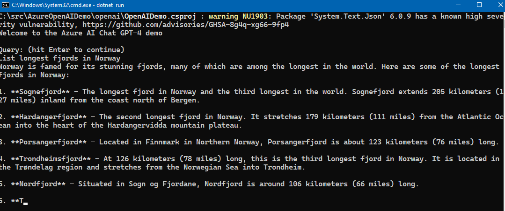

## Azure AI OpenAI Demo

**You will need to create a Azure AI Service resource in Azure to use this**

Currently, it works best using 'US East' as the region for some of the functionality
in Azure AI. However, OpenAI client should work in other regions too of Azure. 

This repo contains useful helper methods to use Azure AI Service and create
_AzureOpenAIClient_ or the more generic _ChatClient_ which is a specified chat client for the 
_AzureOpenAIClient_ that uses a specific ai model, default is 'gpt-4'. 

To create a chat client you can simply create it like this :


```csharp
         const string modelName = "gpt-4";

            var chatClient = AzureOpenAIClientBuilder
                .Instance
                .WithDefaultEndpointFromEnvironmentVariable()
                .WithDefaultKeyFromEnvironmentVariable()
                .BuildChatClient(aiModel: modelName);
```

Add the key and endpoint to your Azure AI to these user specific environment variables. 

<ul>
     <li>AZURE_AI_SERVICES_KEY</li>
     <li>AZURE_AI_SERVICES_ENDPOINT</li>

</ul>

To use the chat client the following code shows how to do this:

```
    public async Task<string?> RunChatGptQuery(ChatClient? chatClient, string msg)
        {
            if (chatClient == null)
            {
                Console.WriteLine("Sorry, the demo failed. The chatClient did not initialize propertly.");
                return null;
            }

            var stopWatch = Stopwatch.StartNew();

            string reply = await chatClient.GetStreamedReplyStringAsync(msg, outputToConsole: true);

            Console.WriteLine($"The operation took: {stopWatch.ElapsedMilliseconds} ms");


            Console.WriteLine();

            return reply;
        }

```

The essence is this line:

```
    string reply = await chatClient.GetStreamedReplyStringAsync(msg, outputToConsole: true);

```

This repo contains helper functionality to get started with the Chat GPT-4 client. See the
helper extension class and builder class for more information.


Screenshot


Last update: 

30th of November 2024, 

Tore Aurstad IT 

